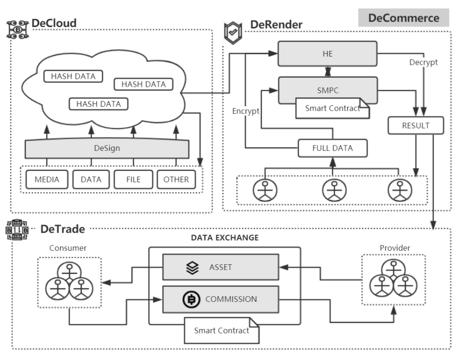

# DeCommerce
Blockchain-based enterprise appication framework

## Application  

DeCommerce, a decentralized commercial framework, focuses on providing enterprise-grade decentralized network services, including the data storage system – DeCloud, the computing framework – DeRender, and the data trading framework – DeTrade. Which provides multi-party collaborative participation for business users and ensures the privacy and security of data and transactions.

## FrameWork Diagram 




# Hierarchical 

```js
- DeCommerce
|-- DeCloud
|   |   `-- DeSign
|   |   `-- Hash_Data
|       `-- OffChain_Data
|-- DeRender
|   |   `-- HE
|       `-- SMPC
|-- DeTrade
|   |   `-- Data_Trade
|       `-- Transaction_Query
```
